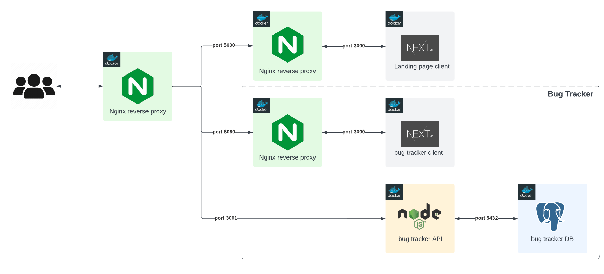

# Bug tracker
## Introduction
This project is a web based bug tracker system (similar to [Jira by Atlassian](https://www.atlassian.com/software/jira)) whose purpose is to show tech recruiters my technical skills for possible job opportunities.

## Demo
You can play with this project at [roysalazar.dev/app/bug-tracker](http://3.76.1.136/app/bug-tracker) (and see the roadman [here](https://jira.external-share.com/issue/43460/bug_tracker_board?groupBy=EPIC)).

## What skills do I present in this project?
### Best practices
- Good documentation.
- Abstraction of business logic from the framework (as much as reasonable).
- Graceful error handling.
- Test the most critical parts of the application. I understand what takes priority when testing.
- Good code formatting.
- Easy to understand and maintain code:
    - DRY and [SOLID](https://youtu.be/_jDNAf3CzeY?t=291).
    - Clear function names.
    - Short comments when needed, inform/warn other developers.
    - Clear separation of responsibilities between different parts of the application.
- Dev and prod environments
### Frontend
**React | Redux | Vitest |  Cypress**
- Well-structured HTML & CSS.
- Good understanding of modern frontend frameworks.
- Eye for design (UI/UX).
- Good global/local state management.
- Test in multiple browsers.
- Easy to follow components logic.
- Good understanding of communication protocol between the Client and the API (HTTP protocol and REST API).
### Backend
**Nodej | Expres | OpenAPI 3.0 | Zod | Vitest**
- Good API documentation.
- Good REST API endpoints structure.
- Integration testing of API with mock database.

### Database
**PostgreSQL**
- Good database schema design.
- Programatically database setup.

### CI/CD & Cloud
**Docker | Github Actions | AWS Services (EC2, Elastic IP and S3)**

## Architecture

## Docs
- [How to run this project locally](docs/run-locally.md)
- [CI/CD for this project](docs/cicd.md)

## License
License - [MIT](https://choosealicense.com/licenses/mit/)

