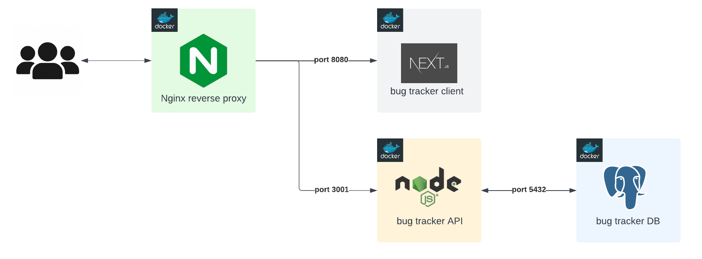

## Run Locally - dev environment
## Architecture



Prerequisites, install:
- [Docker](https://www.docker.com/get-started/)
- [Docker compose](https://docs.docker.com/compose/install/)

```bash
  git clone https://github.com/roysalazarp/portfolio_apps_bug-tracker.git
```
```bash
  cd portfolio_apps_bug-tracker
```
```bash
  docker compose -f docker-compose.dev.yml up --build
```

| Access   | Url              |
| -------- | ---------------- |
| Frontend | localhost:80     |
| Backend  | localhost:80/api |
## Environment Variables
Env variables are found in `dev-env` folder. 


### Docker

Dockerfiles:

- [Nginx reverse proxy](../nginx/Dockerfile)
- **Dev** environment - [frontend](../frontend/Dockerfile.dev) & [backend](../backend/Dockerfile.dev)
- **Test** ***watching*** environment - [frontend](../frontend/Dockerfile.dev.test) & [backend](../backend/Dockerfile.dev.test)